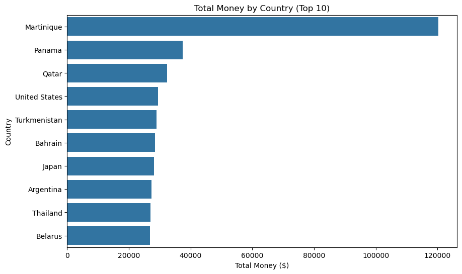
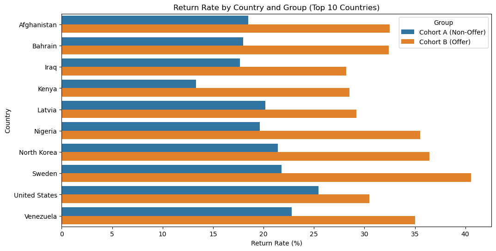
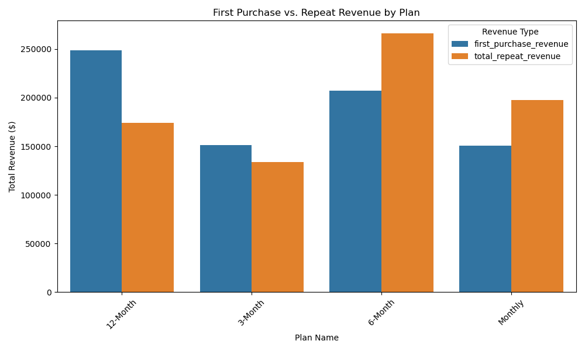
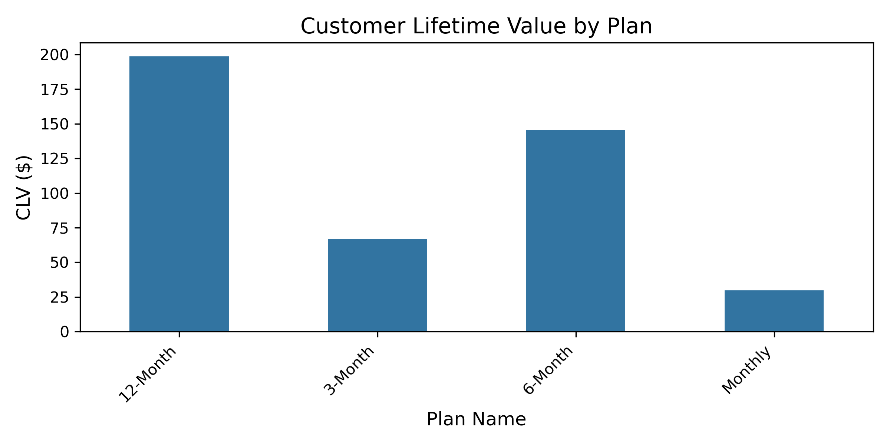

## OTT Platform Case Study - Customer Purchase Behavior Analysis

A data analysis project exploring how **coupons affect customer behavior** on an OTT platform - comparing users who joined **with** and **without** coupons.  
This notebook performs complete data preparation, merging, cleaning, and analysis using multiple Excel sheets.

##  Overview

This project analyzes **customer purchase behavior** for an OTT platform to understand:
- How coupon campaigns influence user acquisition.
- Differences in repeat purchase patterns between coupon and non-coupon groups.
- Revenue impact across regions and subscription plans.
- Dives deep into analysing the plans

The analysis compares:
- **Group A:** Users who joined *without* a coupon  
- **Group B:** Users who joined *with* a coupon  

Key metrics studied:
- New customer growth  
- First purchase revenue  
- Repeat purchase rate  
- Total and repeat purchase revenue  

---

## Dataset Description

The dataset comes from an Excel workbook `Revenue.xlsx` containing multiple sheets.

| Sheet Name | Description |
|-------------|-------------|
| `revenue` | Transaction-level revenue data |
| `plan` | Subscription plan details |
| `countries` | Country and region mapping |
| `subscription` | User subscription records |
| `customers` | Customer demographics and signup info |

---


> All required libraries are listed in the `requirements.txt` file.

---

## Notebook Workflow

### Importing Libraries
The notebook starts by importing all necessary tools for data manipulation and visualization.

~~~python
import pandas as pd
import numpy as np
import matplotlib.pyplot as plt
import seaborn as sns
from datetime import datetime
print("I got all the tools I need!")
~~~

###  Loading the Data
~~~python
file_location = 'Revenue.xlsx'
revenue_data = pd.read_excel(file_location, sheet_name='revenue')
plan_data = pd.read_excel(file_location, sheet_name='plan')
countries_data = pd.read_excel(file_location, sheet_name='countries')
subscription_data = pd.read_excel(file_location, sheet_name='subscription')
customers_data = pd.read_excel(file_location, sheet_name='customers')
~~~

###  Inspecting the Data
Preview and understand the structure of each dataset:

```python
# Check how big each data table is
print("Sizes of data tables:\nRevenue:", revenue_data.shape,
      "\nPlan:", plan_data.shape,
      "\nCountries:", countries_data.shape,
      "\nSubscription:", subscription_data.shape,
      "\nCustomers:", customers_data.shape)

# Check how big each data table is
print("Data infos of each data tables:")
print("Revenue data:")
print(revenue_data.info())
print("\nPlan data:")
print(plan_data.info())
print("\nCountries data:")
print(countries_data.info())
print("\nSubscription data:")
print(subscription_data.info())
print("\nCountries data:")
print(customers_data.info())
```

###  Data Cleaning
- Checked for missing values and duplicates   
- Standardized date and numeric formats  
- Verified dataset integrity across foreign keys (`customer_id`, `plan_id`, etc.)

~~~python
# Fix the dates in the revenue data to be readable
revenue_data['payment_date'] = pd.to_datetime(revenue_data['payment_date'], errors='coerce')
# Remove rows where dates are missing
revenue_data = revenue_data.dropna(subset=['payment_date'])

# Make sure amounts are numbers and not less than Zero
revenue_data['amount'] = pd.to_numeric(revenue_data['amount'], errors='coerce')
revenue_data = revenue_data[revenue_data['amount']>0]
# Remove rows where amounts are missing
revenue_data = revenue_data.dropna(subset=['amount'])

# Remove any duplicate rows
revenue_data = revenue_data.drop_duplicates()
~~~

###  Data Wrangling
Merged multiple datasets into one master DataFrame for analysis:
- Joined `revenue_data` with `customers_data`, `subscription_data`, and `plan_data`.
- Added region mapping from `countries_data`.
```python
# Start by combining revenue and subscription data using order_id
final_table = pd.merge(revenue_data, subscription_data, on='order_id', how='inner')
# Add customer details using customer_id
final_table = pd.merge(final_table, customers_data, left_on='customer_id', right_on='id', how='inner')

# Add country names using country_id
final_table = pd.merge(final_table, countries_data, left_on='country_id', right_on='id', how='inner')

# Add plan names using plan_id
final_table = pd.merge(final_table, plan_data, left_on='plan_id', right_on='Id', how='inner')

# Keep only the columns we want to use
final_table = final_table[['order_id', 'payment_date', 'amount', 'coupon_code', 
                       'customer_id', 'email', 'name', 'country_name', 'plan_name']]
```
### EDA 
See how much money comes from each country and make a simple picture.
```python
# Group the data by country to see totals
country_totals = final_table.groupby('country_name').agg(
    orders=('order_id', 'count'),  # Count how many orders
    total_revenue=('amount', 'sum'),  # Add up all amount
    avg_order_value=('amount', 'mean')  # Average money per order
).reset_index()
# Make a visual of the top 10 countries' total money
top_10_countries = country_totals.head(10)
plt.figure(figsize=(10, 6))  # Set the picture size
sns.barplot(x='total_revenue', y='country_name', data=top_10_countries)  # Make bars
plt.title('Total Money by Country (Top 10)')  # Add a title
```
#### Visualization


###  Group and Cohort Analysis
Performed group-based metrics:
- Compared revenue between **Group A (non-coupon)** and **Group B (coupon)**  
- Tracked repeat purchase rates  
- Segmented insights by country and plan type
```python
# Make a visual of return rates for the top 10 countries
top_countries_list = final_table.groupby('country_name')['unique_customers'].sum().nlargest(10).index
plot_data = final_table[final_table['country_name'].isin(top_countries_list)]
plt.figure(figsize=(12, 6))  # Set picture size
sns.barplot(x='retention_rate', y='country_name', hue='cohort', data=plot_data)  # Make bars with groups
plt.title('Return Rate by Country and Group (Top 10 Countries)')  # Add title
```
---
### Visualization



## Other Visualizations



---


## Key Insights

- **Group A (No Coupon)** - Consistent repeat purchase behavior and stable long-term revenue.  
- **Group B (With Coupon)** - Higher initial acquisition but weaker repeat retention.  
- **Regional Differences** - Coupon campaigns were most effective in certain markets.  
-  **Subscription Plans** - Longer plans correlate with stronger retention and lifetime value.  


---

## How to Run

1. Ensure `Revenue.xlsx` is in the same directory as the notebook.  
2. Open the notebook:
   ~~~bash
   jupyter notebook "OTT - Customer_Purchase_Analysis.ipynb"
   ~~~
3. Run all cells sequentially.  
4. Visualizations will be generated.


---


  *If you found this helpful, consider starring the repo!*

